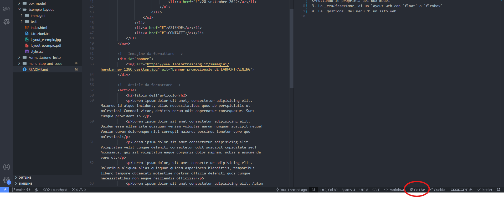
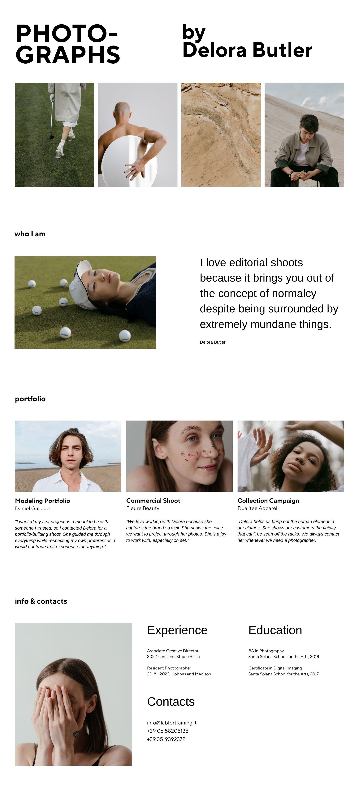
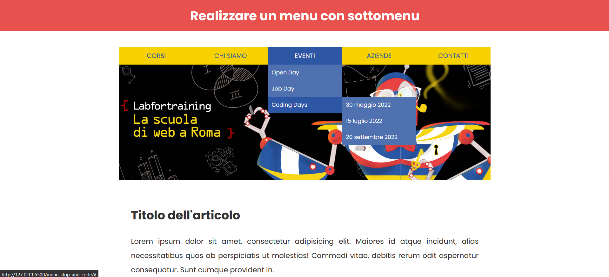

# Configuration

> [!WARNING]
> If you use VS Code, please install Live Server extension to open each project

# Projects

In this repository we have the following projects:

-   Formattazione-Testo
-   box-model
-   Esempio-Layout
-   menu-stop-and-code

## 1 Formattazione-Testo

In this project we have to replicate the template based on `HTML5.pdf` by _formatting_ each text of the html file with tags.

> [!NOTE]
> For this project it isn't needed to add any CSS styles.

## 2 box-model

In this project we have five folder with a html file and CSS file. For every folder we have to follow the rules that is described on the html file by adding CSS styles to every template.

## 3 Esempio-Layout

In this project we have to replicate the template shown on `layout_esempio.png` by using or _float_ or _flex-box_.

## 4 menu-stop-and-code

In this project we have to replicate the template and create a nested navbar with 3 `<ul>` tags

